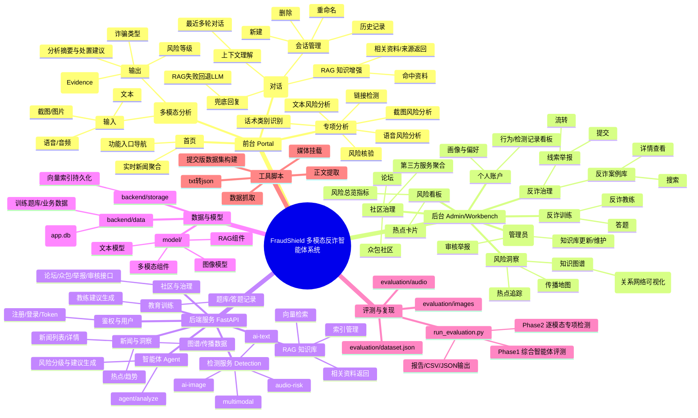

# FraudShield 多模态反诈智能体系统

FraudShield 是一个面向真实反诈场景设计的多模态智能体系统，围绕“感知、决策、干预、进化”四个方向，构建了一个集风险识别、智能咨询、后台洞察、治理闭环与安全教育于一体的综合反诈平台。

项目聚焦当前诈骗高发、多样化、智能化的发展趋势，尝试通过文本、图像、语音等多模态输入能力，结合知识库增强、上下文理解、用户画像、后台治理和训练模块，提供一个更贴近真实业务场景的反诈解决方案。

## 项目概览

- 前端：Vue 3 + Vite，位于 `frontend/`
- 后端：FastAPI + SQLAlchemy，位于 `backend/`
- 本地模型与资源：位于 `model/`
- 数据构建与辅助脚本：位于 `scripts/`
- 评测集与测评脚本：位于 `evaluation/`

## 项目定位

FraudShield 不是单点的“识别工具”，而是一个覆盖前台分析、智能咨询、后台治理与教育训练的完整反诈系统。

它主要解决以下问题：

- 传统规则系统难以覆盖文本、截图、语音等多模态诈骗输入
- 单轮问答难以稳定理解上下文，容易出现解释不连贯或幻觉
- 反诈能力往往停留在识别阶段，缺少治理、审核、举报、学习闭环
- 后台缺乏对热点传播、知识关联与风险关系网络的统一洞察

## 核心亮点

### 1. 多模态统一分析

系统支持文本、截图、语音输入，并在统一分析页中输出风险等级、诈骗类型、摘要、证据项和处置建议，适合实际演示与交互场景。

### 2. 专项检测能力

除统一分析外，系统还提供独立的专项分析能力，包括：

- 文本风险分析
- 截图风险分析
- 语音风险分析
- 链接检测
- 话术类别识别
- 风险核验

### 3. 反诈助手与知识增强

系统内置反诈助手，支持多轮上下文、RAG 知识增强、相关资料返回和会话管理，能够在连续咨询场景下提供更稳定、更可解释的回复。

### 4. 风险洞察与治理闭环

后台支持风险看板、热点追踪、知识图谱、传播地图、案例库、举报线索、论坛与审核工作台，形成从发现问题到处理问题的完整治理路径。

### 5. 教育训练与个性化画像

系统支持用户画像配置，并结合答题训练和反诈教练，为不同用户提供差异化提醒、防护建议和学习路径。

## 功能脑图

下面的脑图从功能视角总结了项目的整体结构。



## 主要模块说明

### 首页

首页承担引入背景、展示核心入口和聚合新闻的作用，用于建立“当前风险环境感知”。

### 统一分析

统一分析是前台核心入口，支持文本、截图、语音联合输入，并输出风险等级、诈骗类型、摘要、证据项与处置建议。

### 专项分析

专项分析面向更明确的使用场景，将文本、图片、语音、链接与话术识别能力拆分为独立页面，便于单项验证与演示。

### 反诈助手

反诈助手支持多轮上下文、知识增强、相关资料回溯与会话管理，用于提供更稳定的咨询式交互。

### 风险洞察

后台通过热点追踪、知识图谱和传播地图，从时间、关系与空间三个维度展示风险传播与关联信息。

### 反诈治理

围绕案例库、详情页、举报线索与审核工作台，形成治理闭环。

### 社区治理

包括论坛、众包社区与第三方平台聚合，用于扩大用户参与和外部联动能力。

### 反诈训练

通过答题与反诈教练，提供持续性的识诈训练和安全教育。

### 模型与能力

- 文本风险分析
- 图像/截图风险分析
- 语音转写与音频风险分析
- RAG 知识检索
- 多模态联合分析

## 项目结构

```text
.
├── backend/
│   ├── app/
│   │   ├── api/            # 路由层
│   │   ├── core/           # 配置、日志、安全
│   │   ├── db/             # 数据库初始化与 ORM
│   │   ├── repositories/   # 数据访问层
│   │   ├── schemas/        # 接口请求/响应模型
│   │   ├── services/       # 业务服务层
│   │   ├── tasks/          # 后台任务
│   │   └── ws/             # Socket.IO / WebSocket
│   ├── data/               # 本地运行数据
│   ├── storage/            # RAG 索引持久化
│   ├── tests/              # 后端测试
│   ├── main.py             # 后端入口
│   └── INIT.md             # 后端结构说明
├── frontend/
│   ├── public/             # 静态资源
│   ├── src/                # 前端源码
│   ├── vite.config.ts      # 前端构建配置
│   └── INIT.md             # 前端结构说明
├── model/
│   ├── ai_text/            # 文本模型逻辑
│   ├── ai_image/           # 图像模型逻辑
│   ├── fake_news/          # 内容识别与分类
│   ├── multimodal/         # 多模态资源
│   ├── rag/                # RAG 相关逻辑
│   ├── common/             # 公共模型工具
│   ├── registry.py         # 模型注册
│   └── INIT.md             # 模型层说明
├── evaluation/             # 测评集与一键评测脚本
├── scripts/                # 数据构建与辅助脚本
└── README.md
```

## 快速开始

### 1. 后端启动

```bash
cd backend
python -m venv venv
# Windows PowerShell
.\venv\Scripts\Activate.ps1
pip install -r requirements.txt
```

配置环境变量：

- 将 `backend/.env.expamle` 复制为 `backend/.env`
- 按实际情况填写模型、语音转写、视觉能力等接口配置

启动后端：

```bash
cd backend
python main.py
```

健康检查：

```bash
curl http://127.0.0.1:8000/health
```

### 2. 前端启动

```bash
cd frontend
npm install
npm run dev
```

默认访问地址：

- 前端：`http://127.0.0.1:5173`
- 后端：`http://127.0.0.1:8000`

## 模型、数据与索引资源

由于模型文件、知识库数据、索引文件和部分运行资源体积较大，默认不放在 GitHub 仓库中。

补充资源下载：

`https://pan.baidu.com/s/1wDXcULRm1U2SvLzCl0BRLQ?pwd=fwwb`

下载后按目录放置：

- `model/`：本地模型与权重资源
- `backend/data/`：数据库、题库与业务数据
- `backend/storage/`：RAG 索引与持久化向量存储

## 评测复现

`evaluation/` 目录下包含当前项目的评测集与复现脚本：

- `evaluation/dataset.json`
- `evaluation/images/`
- `evaluation/audio/`
- `evaluation/run_evaluation.py`

完整评测：

```bash
python evaluation/run_evaluation.py --base-url http://127.0.0.1:8000 --username admin --password 123456
```

仅复跑专项检测阶段：

```bash
python evaluation/run_evaluation.py --base-url http://127.0.0.1:8000 --username admin --password 123456 --skip-phase1
```

输出结果位于 `evaluation/results/`：

- `evaluation_report.md`
- `evaluation_summary.csv`
- `phase1_agent_results.json`
- `phase2_detection_results.json`

## 常见问题

- 音频检测结果异常：检查 `backend/.env` 中是否正确配置 `ZHIPU_AUDIO_API_KEY`
- 前后端联调失败：确认后端是否启动、前端接口地址是否正确、CORS 是否包含前端地址
- RAG 结果异常：检查 `backend/storage/` 中索引文件是否完整
- 首次启动模型需要加载一段时间，期间使用其他功能可能超时显示失败，属于正常现象。

## 项目愿景

面对不断演化的诈骗手法，真正有效的反诈不应只是事后补救，而应是更早感知、更准判断、更快干预和持续进化。

FraudShield 希望通过多模态识别、知识增强、智能交互和治理闭环，成为一个既能服务普通用户、又能支撑后台治理的智能反诈系统，为构建更安全的数字环境提供新的思路。
