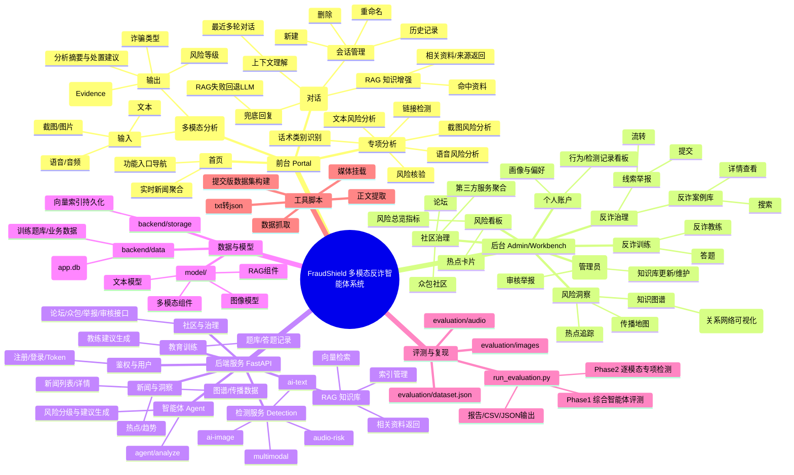

# FraudShield 多模态反诈智能体系统

> 面向真实反诈场景的多模态智能体平台，覆盖统一分析、专项检测、反诈助手、风险洞察、后台治理与训练闭环。

<p align="center">
  
  
  
  
  
</p>

## 项目简介

FraudShield 是一个面向真实诈骗识别与治理场景设计的多模态反诈智能体系统。项目以“感知、决策、干预、进化”为主线，将文本、截图、语音等输入能力，与知识库增强、上下文对话、用户画像、后台治理和训练模块整合到同一个系统中。

它不是单点识别工具，而是一个覆盖前台体验、智能咨询、后台分析、社区参与和管理审核的完整反诈平台，适合比赛展示、系统演示与后续扩展。

## 为什么做这个项目

当前诈骗手法正在向高频化、跨平台、多模态和智能化方向演进。传统依赖人工审核和固定规则的方式，通常存在以下局限：

- 对新型诈骗剧本反应慢，更新周期长
- 很难同时处理文本、图片、语音等多模态输入
- 缺少连续上下文理解，容易出现单轮判断失真
- 缺少从识别到治理、从发现到学习的完整闭环

FraudShield 尝试用多模态能力、知识增强和治理流程，把“识别诈骗”从单次检测，推进到更完整的“风险发现 + 分析解释 + 后台治理 + 用户教育”体系。

## 核心特性

### 多模态统一分析

- 支持文本、截图、语音联合输入
- 输出风险等级、诈骗类型、摘要、证据项和处置建议
- 适合演示真实用户场景中的统一分析能力

### 专项检测能力

- 文本风险分析
- 截图风险分析
- 语音风险分析
- 链接检测
- 话术类别识别
- 风险核验

### 反诈助手

- 多轮上下文对话
- RAG 知识增强
- 相关资料返回
- 会话管理（历史记录、重命名、删除）

### 后台治理闭环

- 风险看板
- 热点追踪
- 知识图谱
- 传播地图
- 反诈案例库
- 线索举报
- 审核工作台

### 教育训练

- 答题训练
- 反诈教练
- 个性化学习建议

## 功能脑图

下面的脑图从功能视角总结了系统的主要模块。



## 技术架构

### 前端

- Vue 3
- Vite
- TypeScript
- Pinia

### 后端

- FastAPI
- SQLAlchemy
- SQLite
- Pydantic
- chroma

### 模型与能力层

- 文本风险分析
- 截图/图片风险分析
- 语音转写与语音风险分析
- RAG 知识检索
- 多模态联合分析

### RAG 与 Chroma 知识增强

项目当前的知识增强链路基于 `LlamaIndex + Chroma` 实现。

- 向量后端：`Chroma`
- 持久化目录：`backend/storage/chroma_db/`
- 嵌入模型：默认 `BAAI/bge-small-zh-v1.5`
- 检索参数：默认 `SIMILARITY_TOP_K = 3`
- 索引清单：`backend/storage/knowledge_index_manifest.json`

运行机制：

- 后端启动后会在后台执行 RAG 预热，优先加载已有的 Chroma 集合；
- 反诈助手提问时，系统会先进行向量检索，再将召回资料与用户问题一起发送给大模型生成知识增强回答，并同时返回相关资料卡片。
- 管理员执行“新增知识库索引”时，系统会基于已审核通过的知识条目做增量追加；只有在 Chroma 不存在时，才会退化为一次完整重建。

```text
.
├── backend/
│   ├── app/
│   │   ├── api/            # 路由层
│   │   ├── core/           # 配置、日志、安全
│   │   ├── db/             # 数据库与 ORM
│   │   ├── repositories/   # 数据访问层
│   │   ├── schemas/        # 请求/响应模型
│   │   ├── services/       # 业务服务
│   │   ├── tasks/          # 后台任务
│   │   └── ws/             # Socket.IO / WebSocket
│   ├── data/               # 本地业务数据
│   ├── storage/            # Chroma 索引
│   ├── tests/              # 后端测试
│   ├── main.py             # 后端入口
├── frontend/
│   ├── public/             # 静态资源
│   ├── src/                # 前端源码
│   ├── vite.config.ts      # 构建配置
├── model/
│   ├── ai_text/            # 文本模型逻辑
│   ├── ai_image/           # 图像模型逻辑
│   ├── fake_news/          # 内容识别与分类
│   ├── multimodal/         # 多模态资源
│   ├── rag/                # RAG 相关逻辑
│   ├── common/             # 模型公共工具
│   ├── registry.py         # 模型注册
├── evaluation/             # 测评集与评测脚本
├── scripts/                # 数据构建与辅助脚本
└── README.md
```

## 快速开始

如果你需要查看更完整的环境搭建、资源放置、上线部署与运行说明，请直接阅读部署指南：

- [项目安装部署指南](./项目安装部署.md)

### 后端启动

```bash
cd backend
python -m venv venv
# Windows PowerShell
.\venv\Scripts\Activate.ps1
pip install -r requirements.txt
```

配置环境变量：

- 将 `backend/.env.expamle` 复制为 `backend/.env`
- 按需填写模型、视觉、语音转写与外部接口配置

启动后端：

```bash
cd backend
python main.py
```

健康检查：

```bash
curl http://127.0.0.1:8000/health
```

### 前端启动

```bash
cd frontend
npm install
npm run dev
```

默认访问地址：

- 前端：`http://127.0.0.1:5173`
- 后端：`http://127.0.0.1:8000`

## 部署说明

仓库已提供单独的部署文档，适合用于服务器上线、资源文件补充、域名访问与长期运行配置：

- [项目安装部署指南](./项目安装部署.md)

## 补充资源下载

由于模型文件、知识库数据、索引文件和部分运行资源体积较大，默认不在 GitHub 仓库中。

百度网盘：

`https://pan.baidu.com/s/1wDXcULRm1U2SvLzCl0BRLQ?pwd=fwwb`

下载后按目录放置：

- `model/`：本地模型与权重资源
- `backend/data/`：数据库、题库与业务数据
- `backend/storage/`：Chroma 向量库、`knowledge_index_manifest.json` 与相关持久化文件
- `backend/app/static`:地图数据

## 评测复现

`evaluation/` 目录包含当前项目的测评集与一键评测脚本：

- `evaluation/dataset.json`
- `evaluation/images/`
- `evaluation/audio/`
- `evaluation/run_evaluation.py`

完整评测：

```bash
python evaluation/run_evaluation.py --base-url http://127.0.0.1:8000 --username admin --password 123456
```

若仅复跑专项检测阶段并复用已有 Phase 1 结果：

```bash
python evaluation/run_evaluation.py --base-url http://127.0.0.1:8000 --username admin --password 123456 --skip-phase1
```

输出目录：`evaluation/results/`

- `evaluation_report.md`
- `evaluation_summary.csv`
- `phase1_agent_results.json`
- `phase2_detection_results.json`

## 常见问题

- 音频检测结果异常：检查 `backend/.env` 中是否正确配置 `ZHIPU_AUDIO_API_KEY`
- 前后端联调失败：确认后端是否启动，接口地址是否正确，CORS 是否包含前端地址
- RAG 结果异常：优先检查 `backend/storage/chroma_db/` 是否完整、`knowledge_index_manifest.json` 是否正常，以及 `backend/data/fraud_knowledge.json` 是否与当前知识库构建策略一致

- 首次启动模型需要加载一段时间，期间使用其他功能可能超时显示失败，属于正常现象。

## 项目愿景

面对不断演化的诈骗手法，真正有效的反诈不应只是事后补救，而应是更早感知、更准判断、更快干预和持续进化。

FraudShield 希望通过多模态识别、知识增强、智能交互和治理闭环，成为一个既能服务普通用户、又能支撑后台治理的智能反诈系统，为构建更安全的数字环境提供新的思路。
